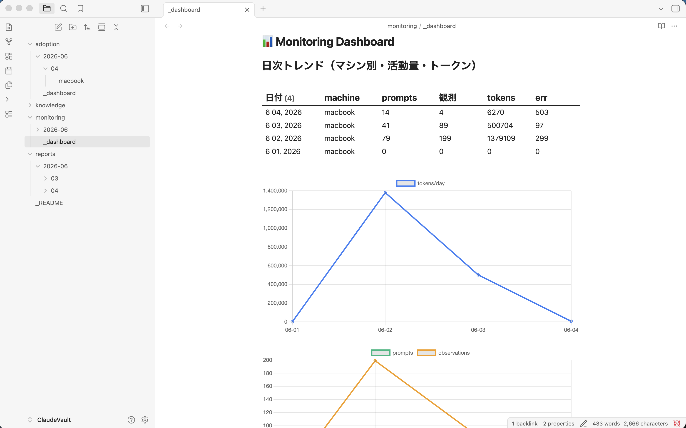

# claude-cowork-agentops

A [Claude Cowork](https://www.anthropic.com/) automation kit that runs a daily
**housekeeping** pass over [claude-mem](https://github.com/thedotmack/claude-mem)
and distills it into **conventions (CLAUDE.md), reusable logic (skills), and
long-term memory (Obsidian)** — with AgentOps (monitoring, alerting, evaluation,
governance) built in.

claude-mem is a recency-window local memory: it carries recent context into the
next session, and older knowledge gets pushed out and lost. This kit is the daily
batch that **rescues what should persist into the long-term layer before it ages out**.

> Set up entirely from Cowork chat: paste [`setup.md`](setup.md) and Claude will
> ask you a few questions (output language, project folder, vault, which tasks)
> and configure everything for you.



> The daily monitoring dashboard in Obsidian (Dataview + Charts): per-machine
> activity/token table and trend lines, generated automatically each night.

## Memory hierarchy

| Layer | Role | Location |
|---|---|---|
| CLAUDE.md | Conventions / structure (per project) | each project (proposed uncommitted in git) |
| skill | Reusable logic | project-specific → `<project>/.claude/skills/` (auto, uncommitted); cross-project → `~/.claude/skills/` (proposal) |
| claude-mem | Short/mid-term memory (local, transient) | `~/.claude-mem` |
| Obsidian vault | Long-term memory (shared across devices) | local path (synced via Obsidian Sync, etc.) |

## Flow

```
Claude Code work -> claude-mem (local, short/mid-term)
        | daily batch (Cowork scheduled task / 00:00)
        |-> CLAUDE.md   : conventions/structure (proposed uncommitted in the most relevant dir)
        |-> skills      : project-specific -> <project>/.claude/skills (auto); cross-project -> ~/.claude (proposal)
        \-> Obsidian vault (long-term)
              |- reports/YYYY-MM/DD/<machine>.md      : that day's work log
              |- knowledge/<slug>.md                   : extracted reusable knowledge (atomic notes)
              |- monitoring/YYYY-MM/DD/<machine>.md    : claude-mem metrics
              \- adoption/YYYY-MM/DD/<machine>.md      : proposal acceptance rate
```

## Components (scripts, stdlib-only Python 3)

| Script | Role |
|---|---|
| `memory_digest.py` | Extract incremental memory from claude-mem.db (state stored locally under `~/.claude-mem`) |
| `monitoring_digest.py` | Daily activity / tokens / memory growth / health note (TZ-correct, real-timestamp log aggregation) |
| `adoption_eval.py` | Acceptance rate of CLAUDE.md proposals (committed vs pending) from git |
| `hotspot.py` | Files with repeated bugfixes over N days = tech-debt hotspots |
| `knowledge_audit.py` | Surface duplicate / stale knowledge notes (helper for monthly consolidation) |
| `redact.py` | Mask API keys / tokens / private keys before writing to the vault |
| `health_check.py` | Inspect claude-mem worker / errors / WAL and judge OK/WARN/ALERT |
| `backfill.py` | (optional, one-time) Backfill monitoring/adoption for past dates if you already had claude-mem — pick the period |

All scripts read the claude-mem DB from a **copy** (never touch the live WAL).
Machine name and timezone come from `~/.claude-mem/machine.json` (local, not synced).
Script output is English; the LLM-authored reports/knowledge use your configured language.

## Scheduled tasks (Cowork)

| taskId | cron | Role |
|---|---|---|
| `claude-mem-housekeeping` | `0 0 * * *` | Daily housekeeping (previous day). Apply CLAUDE.md + write reports/knowledge/monitoring/adoption |
| `claude-mem-healthcheck` | `0 */2 * * *` | Health check every 2h. Alert to Slack + Obsidian on WARN/ALERT only |
| `claude-mem-hotspot` | `0 9 * * 1` | Weekly tech-debt hotspot detection |
| `claude-mem-knowledge-consolidate` | `0 9 1 * *` | Monthly knowledge merge/update/prune (run on ONE machine only) |
| `claude-cowork-agentops-update` | `0 23 * * *` | (optional) `git pull --ff-only` to keep the batch up to date (public repo, anonymous HTTPS; safely skips if the tree is dirty) |

Task prompts to register are in [`scheduled-tasks.md`](scheduled-tasks.md).

## AgentOps pillars

- **Observability** — daily monitoring metrics + Dataview/Charts dashboards.
- **Reliability (active alerting)** — health check detects outages (worker down, disk I/O, WAL anomalies) and notifies Slack.
- **Feedback (evaluation)** — adoption rate quantifies whether proposals are useful (provenance marker isolates pipeline-generated CLAUDE.md).
- **Governance** — redact keeps secrets out of the cloud-synced vault.

## Requirements

- [claude-mem](https://github.com/thedotmack/claude-mem) (`~/.claude-mem/claude-mem.db`)
- Claude Cowork (scheduled tasks + folder access)
- Obsidian + plugins **Dataview** (enable *JavaScript Queries*) and **Obsidian Charts**
- Python 3 (standard library only)

## Quick start

Paste [`setup.md`](setup.md) into Cowork chat and follow the guided setup, or do it
manually per [`INSTALL.md`](INSTALL.md). In short:

1. `git clone` this repo directly inside your **projects root** (the dev folder you connect to Cowork).
2. Create `~/.claude-mem/machine.json`: `{"machine":"<name>","utc_offset_hours":<offset>}`.
3. Connect `~/.claude-mem`, your projects root, and a **local** Obsidian vault in Cowork.
4. Register the scheduled tasks from `scheduled-tasks.md` (choose your report/knowledge language).
5. For Slack alerts: create a channel, put its channel_id in the health-check prompt, Run now once to approve.

## Backfill (optional — existing claude-mem users)

Already had claude-mem before installing this? You can backfill past dates. The
range can be large, so you pick the period.

```bash
python3 backfill.py --list-range                          # see how far back memory goes
python3 backfill.py --vault "<vault>" --days 14            # monitoring + adoption for last 14 days
python3 backfill.py --vault "<vault>" --from 2026-05-01 --to 2026-05-31
```

`monitoring/` and `adoption/` are deterministic (instant). `reports/` and
`knowledge/` are LLM-generated, so backfill them via the **`claude-mem-backfill`**
task in [`scheduled-tasks.md`](scheduled-tasks.md) — keep that window small.
Backfill never commits or moves the daily incremental checkpoint.

## Design notes

- Keep the **vault on a local path** (cloud streaming paths are not mounted in Cowork task VMs). Sync across devices with **Obsidian Sync** or git.
- reports/monitoring/adoption are namespaced by `<machine>.md`, so multiple machines can write to the same vault without conflict. **knowledge is shared** — run monthly consolidation on one machine only.
- CLAUDE.md is **proposed uncommitted**. Review with `git diff`; commit = accept, checkout = discard.
- **CLAUDE.md placement is hierarchical**: the **root** CLAUDE.md stays high-level (overview, conventions, project settings, environment, architecture); **module-specific detail / file-level specifics / localized gotchas go into the CLAUDE.md of the relevant subdirectory** (package/module boundary or where changes concentrate).
- **Skills are placed by scope**: a skill specific to one project is written to that project's `<project>/.claude/skills/` (auto, uncommitted — review like CLAUDE.md); a cross-project skill targets `~/.claude/skills/`.
- `~/.claude/` (global CLAUDE.md / cross-project skills) is not writable from Cowork, so those are proposals only (apply manually).

## License

MIT — see [LICENSE](LICENSE).
